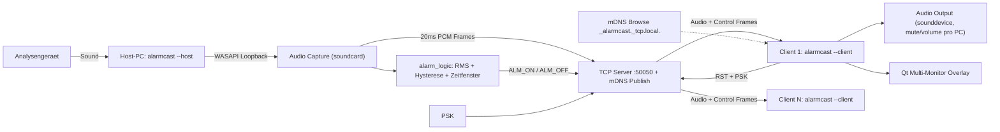

# Alarmcast — Architektur

## Datenfluss



## Module

```text
src/alarmcast/
  __main__.py     # parst --host/--client und delegiert
  core/
    protocol.py        # Framing, Send-Lock
    audio_format.py    # 48 kHz / Mono / int16 / 20 ms
    config.py          # %APPDATA%\AlarmCast\*.json
    discovery.py       # mDNS publish/browse
    security.py        # PSK
    logging_setup.py
    alarm_logic.py     # pure Detektion
  host/
    capture.py    # soundcard WASAPI loopback
    server.py     # TCP :50050, per-client send lock
    detector.py   # capture -> alarm_logic -> server
    app.py        # Qt-Tray + Settings-Fenster
  client/
    net.py        # mDNS browse, TCP-Reconnect
    output.py     # sounddevice output, mute/volume
    overlay.py    # Qt Multi-Monitor Warnoverlay
    app.py        # Qt-Tray + Settings-Fenster + Autostart-Toggle
```

Importregeln: siehe [`.cursor/rules/project-architecture.mdc`](../.cursor/rules/project-architecture.mdc).

## Netzwerk-Protokoll

TCP, Port `50050`. Frame-Layout:

```text
[type: 1 Byte][length: uint32 little endian][payload]
```

Frame-Typen:

| Code | Bedeutung | Payload |
|---|---|---|
| `A` | Audio-Frame | `BYTES_PER_FRAME` Bytes PCM int16 mono |
| `C` | Control-Frame | ASCII, z. B. `ALM:1\n`, `ALM:0\n`, `RST\n`, `MSG:0:<text>\n` |
| `H` | Hello (Auth + Identifikation) | `HELLO:<PCNAME>:<PSK>\n` |

Wichtig:

- **Pro Verbindung ein Send-Lock**. Audio- und Control-Sender duerfen den Socket nur seriell beschreiben. (Prototyp-Bug: parallele `sendall`-Aufrufe verursachten zerschossene Frames.)
- `socket.timeout` ist **kein** Verbindungsende. Nur `recv() == b""` bzw. `OSError` zaehlen.

Host-Nachrichten (`MSG`):

| Payload | Bedeutung am Client (wenn Overlay aktiv) |
|---|---|
| `MSG:0:<text>\n` oder Legacy `MSG:<text>\n` | Nur Statuszeile in der App |
| `MSG:1:<text>\n` | Bottom-Overlay ~10 s (Info) |
| `MSG:2:<text>\n` | Overlay mit „Bestaetigen“ bis Klick |

Der Host waehlt den Modus beim Senden. Der Client kann Nachrichten-Overlays in den Einstellungen deaktivieren (dann immer nur Statuszeile).

## Audioformat (Konstanten in `core/audio_format.py`)

| Wert |
|---|
| Sample-Rate: 48 000 Hz |
| Kanaele: 1 (Mono) |
| Sample-Format: int16 |
| Frame-Dauer: 20 ms |
| Samples pro Frame: 960 |
| Bytes pro Frame: 1 920 |

## Alarm-Logik (`core/alarm_logic.py`)

1. Pro Audio-Frame wird der **RMS**-Pegel berechnet.
2. Ein neues "Signal" zaehlt nur beim Wechsel **unter → ueber** der Schwelle (Hysterese verhindert Dauerton-Mehrfachzaehlung).
3. Ab dem ersten Signal laeuft ein **Zeitfenster** (Default 3 s).
4. Erreicht der Zaehler im Fenster die Zielanzahl (Default 2), wird **Alarm** ausgeloest.
5. Waehrend ein Alarm aktiv ist, wird nicht weiter gezaehlt.
6. `RST` setzt Alarm, Zaehler, Fenster und Signalzustand zurueck.

Pure Funktionen, separat testbar.

## Discovery (`core/discovery.py`)

Host **publiziert** Zeroconf-Service `_alarmcast._tcp.local.` (Port 50050, TXT-Record: `version=1`).
Client **browst** denselben Service und uebernimmt die erste passende Antwort. Fehlt mDNS (z. B. Multicast blockiert), nutzt der Client die manuell konfigurierte `host_addr`.

## Sicherheit (`core/security.py`)

- Host generiert beim ersten Start eine Pre-Shared Key (PSK, 32 Zeichen Base32) und speichert sie in `host.json`. Sie wird im Host-Settings-Fenster zur Verteilung angezeigt.
- Client speichert die PSK in `client.json` und sendet sie als Teil des HELLO-Frames.
- Host vergleicht **konstanzeitig** via `hmac.compare_digest` und schliesst die Verbindung ohne Audio-Frames bei falscher PSK. WARN-Log wird geschrieben.

## Konfiguration

Verzeichnis: `%APPDATA%\AlarmCast\`. Kein Fallback auf "neben EXE" (vermeidet Konflikte bei gemeinsamer EXE auf NAS).

`host.json`:

```json
{
  "psk": "...",
  "threshold_rms": 0.06,
  "signal_target": 2,
  "window_seconds": 3.0,
  "tcp_port": 50050
}
```

`client.json`:

```json
{
  "host_addr": "",
  "psk": "",
  "volume": 0.9,
  "muted": false,
  "output_device_id": -1,
  "autostart_with_windows": true
}
```

`host_addr` leer → Client nutzt mDNS. Eintrag ueberschreibt Discovery.

## Autostart (Client)

Toggle im Client-Settings-Fenster setzt/loescht den Registry-Eintrag unter `HKCU\Software\Microsoft\Windows\CurrentVersion\Run`. Default: **an**.

## Threading-Modell

- **Host**: 1 Thread Capture (`soundcard`), 1 Thread Detector, 1 Thread Server-Accept, 1 Thread pro verbundenem Client (Send-Loop). Qt-Thread bedient die GUI; Kommunikation zwischen Worker und GUI nur per `QtCore.Signal`.
- **Client**: 1 Thread fuer TCP-Receive (blockierend, `socket.timeout=None`), Audio-Output ueber `sounddevice`-Callback (eigener Audio-Thread des Treibers). Overlay laeuft im Qt-Hauptthread.

## Build und Deployment

PyInstaller `--onefile --noconsole --name alarmcast`. Eine EXE fuer beide Modi.

Empfohlene Verteilung:

- EXE pro Praxis-PC lokal kopieren (nicht von NAS starten).
- Konfig liegt sowieso in `%APPDATA%\AlarmCast\` und ist damit unabhaengig vom EXE-Pfad.

## Bekannte Risiken / Future-Work

- mDNS kann in restriktiven Netzen blockiert sein → manuelle Adresse als Fallback bleibt.
- PSK-Verteilung ist out-of-band; QR-Code im Host-GUI ist Future-Work.
- Overlay-Transparenz unter Windows war im Prototyp fragil → Qt loest das mit `WA_TranslucentBackground` + Frameless + Topmost-Fenster sauber.
